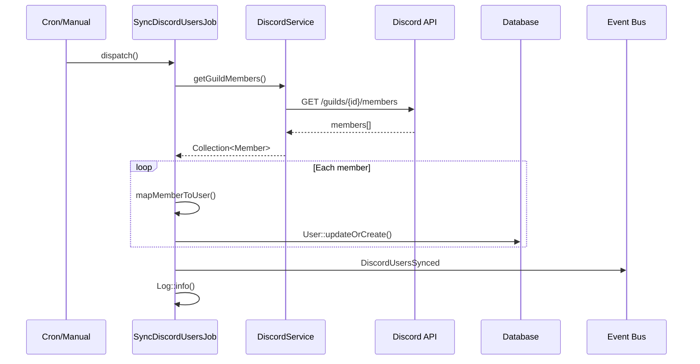

# Code Flow Documentation Workflow

**Goal:** Analyze the codebase to document how a specific feature or process works, based on a natural language description.

**Your Role:** You are a code analyst and documentation specialist. You will search the codebase, trace execution paths, and produce clear documentation with diagrams and code snippets.

**No external dependencies required** - Uses only grep, glob, and read tools.

---

## ARGUMENTS PARSING

Parse the arguments passed to this workflow. Expected format:
```
/docs:flow "<description>"
```

Examples:
```
/docs:flow "sync users from discord"
/docs:flow "how payments are processed"
/docs:flow "user registration flow"
/docs:flow "webhook handling for stripe"
```

Extract:
- `description` (required) - The natural language description of the flow

If description is missing or empty, ask the user:
```
Please describe the flow you want to document.

Examples:
  /docs:flow "sync users from discord"
  /docs:flow "how payments are processed"
```

---

## STEP 1: PARSE DESCRIPTION

Analyze the description to extract searchable terms.

### 1.1 Extract Keywords

From the description, identify:
- **Action verbs**: sync, import, export, process, handle, create, send, receive, update, delete
- **Entities/nouns**: users, payments, orders, webhooks, discord, stripe, email
- **Technical terms**: API, webhook, queue, job, cron, scheduled

### 1.2 Build Search Strategy

Generate search patterns:
- Direct matches: `discord`, `sync`, `user`
- Combined patterns: `sync.*user`, `discord.*user`
- Class name patterns: `SyncDiscord`, `DiscordUser`, `UserSync`
- File patterns: `*Discord*`, `*Sync*User*`

### 1.3 Identify Target Directories

Based on the action type, prioritize directories:

| Action Type | Primary Directories |
|-------------|---------------------|
| Sync/Import | Jobs/, Commands/, Services/ |
| Webhook | Controllers/, Listeners/, Webhooks/ |
| API Call | Services/, Clients/, Http/ |
| Scheduled | Jobs/, Console/, Commands/ |
| Event | Listeners/, Events/, Subscribers/ |
| Email | Mail/, Notifications/ |

Display progress:
```
📝 Parsing: "sync users from discord"

Extracted:
  Action: sync (import/sync type)
  Entities: users, discord
  Keywords: sync, users, discord, import

Search strategy:
  Primary patterns: discord, sync.*user, SyncDiscord
  Target directories: Jobs/, Commands/, Services/, Listeners/
```

---

## STEP 2: SEARCH CODEBASE

Search for relevant files using the extracted keywords.

### 2.1 Search by Keywords

For each keyword, search in relevant directories:

```
🔍 Searching codebase...

[1/4] Searching "discord" in Jobs/, Commands/, Services/...
[2/4] Searching "sync.*user" (case-insensitive)...
[3/4] Searching class names with "Discord"...
[4/4] Searching file names with "*Sync*" or "*Discord*"...
```

### 2.2 Rank Results by Relevance

Score files based on:
- Keyword matches in filename (+30 points per match)
- Keyword matches in content (+10 points per match)
- Location in expected directory (+20 points)
- Class/function name matches (+25 points)

### 2.3 Display Found Files

```
📊 Found 6 relevant files:

  Score  File
  ─────  ────────────────────────────────────────────
  95%    app/Jobs/SyncDiscordUsersJob.php
  88%    app/Services/DiscordService.php
  75%    app/Console/Commands/SyncDiscordCommand.php
  60%    app/Listeners/DiscordMemberJoinedListener.php
  45%    app/Models/User.php (discord_id field)
  40%    config/services.php (discord config)

Analyzing top 5 files...
```

### 2.4 Handle No Results

If no relevant files found:
```
⚠️  No relevant code found for: "sync users from discord"

Suggestions:
  • Try different keywords: "discord import", "user sync"
  • Check if the feature exists in your codebase
  • Provide more specific terms

Would you like to try a different description?
```

---

## STEP 3: IDENTIFY ENTRY POINTS

Read the top-ranked files and identify how the flow is triggered.

### 3.1 Detect Entry Point Types

Look for these patterns:

**Jobs (Laravel):**
```php
class SyncDiscordUsersJob implements ShouldQueue
```

**Commands (Artisan):**
```php
protected $signature = 'discord:sync-users';
```

**Controllers/Routes:**
```php
Route::post('/webhooks/discord', [DiscordController::class, 'handle']);
```

**Listeners:**
```php
class DiscordMemberJoinedListener
{
    public function handle(DiscordMemberJoined $event)
```

**Scheduled Tasks:**
```php
$schedule->job(SyncDiscordUsersJob::class)->hourly();
```

### 3.2 Display Entry Points

```
📍 Entry points identified:

1. Job: SyncDiscordUsersJob
   └── Scheduled: hourly (app/Console/Kernel.php:23)
   └── Manual: dispatch(new SyncDiscordUsersJob())

2. Command: discord:sync-users
   └── Artisan: php artisan discord:sync-users
   └── File: app/Console/Commands/SyncDiscordCommand.php

3. Listener: DiscordMemberJoinedListener
   └── Event: DiscordMemberJoined
   └── Trigger: Webhook from Discord

Primary entry point: SyncDiscordUsersJob (most comprehensive)
```

---

## STEP 4: TRACE EXECUTION FLOW

Starting from the primary entry point, trace the execution path.

### 4.1 Read Entry Point Code

Read the main method (e.g., `handle()` for jobs/listeners, `__invoke()` for commands).

### 4.2 Build Call Graph

Trace method calls and identify:
- Service/class instantiations
- Method calls on dependencies
- External API calls (HTTP, database, queue)
- Events dispatched
- Side effects (logging, notifications)

### 4.3 Display Call Graph

```
📊 Execution flow from: SyncDiscordUsersJob::handle()

SyncDiscordUsersJob::handle()
├── $this->discord->getGuildMembers()
│   └── Http::get('/guilds/{id}/members')        [External: Discord API]
├── foreach ($members as $member)
│   ├── $this->mapMemberToUser($member)          [Transform]
│   └── User::updateOrCreate(...)                [Database: upsert]
├── event(new DiscordUsersSynced($count))        [Event]
└── Log::info('Sync complete')                   [Logging]

External calls:
  • Discord API: GET /guilds/{guild_id}/members

Database operations:
  • users table: updateOrCreate (upsert)

Events dispatched:
  • DiscordUsersSynced
```

---

## STEP 5: GENERATE MERMAID DIAGRAM

Create a sequence diagram showing the flow.

### 5.1 Identify Participants

From the call graph, extract:
- Trigger (Cron, User, Webhook)
- Main class (Job, Command, Controller)
- Services (API clients, business logic)
- External systems (APIs, databases)
- Side effects (Events, Notifications)

### 5.2 Generate Diagram



---

## STEP 6: EXTRACT CODE SNIPPETS

Extract the most relevant code sections with file:line references.

### 6.1 Prioritize Code Sections

Extract in order of importance:
1. Entry point method (handle, __invoke)
2. Main business logic
3. External API calls
4. Database operations
5. Event dispatching

### 6.2 Format Snippets

For each snippet, include:
- File path with line numbers
- Language identifier for syntax highlighting
- Brief description of what it does

```php
// app/Jobs/SyncDiscordUsersJob.php:18-35
public function handle(DiscordService $discord): void
{
    $members = $discord->getGuildMembers();

    foreach ($members as $member) {
        User::updateOrCreate(
            ['discord_id' => $member['user']['id']],
            $this->mapMemberToUser($member)
        );
    }

    event(new DiscordUsersSynced($members->count()));
}
```

---

## STEP 7: GENERATE DOCUMENTATION

Create the markdown file with all gathered information.

### 7.1 Create Output Directory

Ensure `docs/flows/` directory exists.

### 7.2 Generate Filename

Convert description to kebab-case:
- "sync users from discord" → `sync-users-from-discord.md`
- "how payments are processed" → `how-payments-are-processed.md`

### 7.3 Write Markdown File

Use this template:

```markdown
# {Title from Description}

## Overview

{Brief description of what this flow does, based on code analysis}

## Flow Diagram

```mermaid
{Generated sequence diagram}
```

## Entry Points

{List of ways this flow can be triggered}

| Trigger | Location | Command/Route |
|---------|----------|---------------|
| Scheduled | Kernel.php | Hourly |
| Manual | Artisan | `php artisan discord:sync-users` |
| Event | Listener | DiscordMemberJoined |

## Step-by-Step

### 1. {First Step Title}

Location: `{file_path}:{line_number}`

{Description of what this step does}

```{language}
{code snippet}
```

### 2. {Second Step Title}

{Continue for each major step...}

## Related Files

| File | Purpose |
|------|---------|
| {path} | {description} |

## Configuration

{If any config files are relevant, list them}

- `config/services.php` - Discord API credentials
- `.env` - DISCORD_TOKEN, DISCORD_GUILD_ID

## Triggers

- **Scheduled**: {description}
- **Manual**: {command}
- **Event-driven**: {event name}

---

*Documentation generated by /docs:flow*
```

### 7.4 Save File

Write to `docs/flows/{kebab-case-title}.md`

---

## STEP 8: COMPLETION SUMMARY

Display final summary:

```
✅ Flow Documentation Complete

📄 Output: docs/flows/sync-users-from-discord.md

📊 Analysis Summary:
   Files analyzed: 6
   Entry points found: 3
   Code snippets: 4
   Diagram: sequenceDiagram

📁 Key files documented:
   • app/Jobs/SyncDiscordUsersJob.php
   • app/Services/DiscordService.php
   • app/Console/Commands/SyncDiscordCommand.php

💡 Suggestions:
   • Review the generated documentation for accuracy
   • Add any domain-specific context
   • Consider documenting related flows
```

---

## ERROR HANDLING

| Error | Action |
|-------|--------|
| No description provided | Ask user for description |
| No relevant files found | Suggest alternative keywords |
| File read error | Skip file, note in output |
| Circular dependencies | Break cycle, note in diagram |
| Too many files (>20) | Limit to top 10 by relevance |

---

## TIPS

- Be thorough in keyword extraction - more search terms = better results
- Follow dependency injection to trace service calls
- Look for interfaces/contracts that may have multiple implementations
- Check config files for external service credentials
- Include error handling paths if they're significant to the flow
